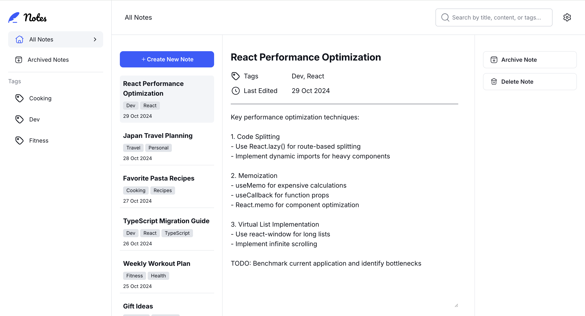

# Frontend Mentor - Note-taking web app solution

This is a solution to the [Note-taking web app challenge on Frontend Mentor](https://www.frontendmentor.io/challenges/note-taking-web-app-773r7bUfOG). Frontend Mentor challenges help you improve your coding skills by building realistic projects.

## The challenge

Users should be able to:

- Create, read, update, and delete notes
- Archive notes
- View all their notes
- View all archived notes
- View notes with specific tags
- Search notes by title, tag, and content
- Select their color theme
- Select their font theme
- Receive validation messages if required form fields aren't completed
- Navigate the whole app and perform all actions using only their keyboard
- View the optimal layout for the interface depending on their device's screen size
- See hover and focus states for all interactive elements on the page
- **Bonus**: Save details to a database (build the project as a full-stack app)
- **Bonus**: Create an account, log in, change password (add user authentication to the full-stack app)
- **Bonus**: Reset their password (add password reset to the full-stack app)

## Screenshot

## Links

- Solution URL: [frontendmentor.io](https://your-solution-url.com)
- Live Site URL: [netlify](https://your-live-site-url.com)

## Built with

- [React](https://reactjs.org/) - JS library
- [Next.js](https://nextjs.org/) - React framework
- [Tailwind CSS](https://tailwindcss.com/) - CSS framework
- [Jotai](https://jotai.org/) - State management library
- [Moment](https://momentjs.com/) - Date utility library
- [Yup](https://github.com/jquense/yup) - Schema validation library

## Project Status

This project is approximately 90% complete. The main functionality is fully implemented and working as intended. While I'm not actively working on it at the moment, I may return to it in the future to complete the remaining small enhancements and polish.
